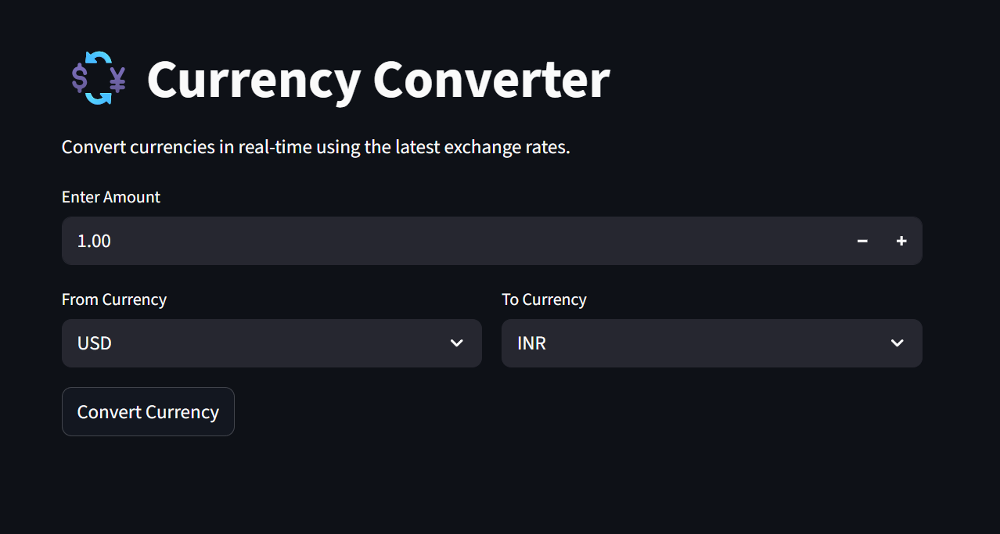
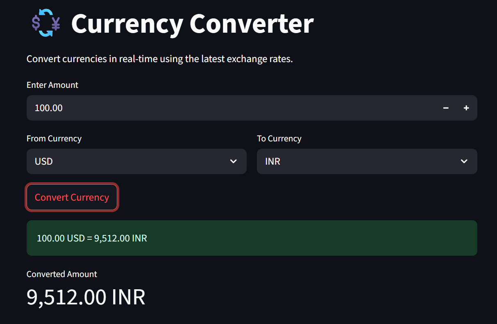

# 💱 Currency Converter App

A modern and user-friendly Currency Converter web application built with Streamlit and powered by the Frankfurter API. This application allows users to convert currencies in real-time using live exchange rates without requiring an API key.

---

## 📌 Project Overview

The Currency Converter App enables users to:

* Convert currencies instantly using live exchange rates.
* Select source and target currencies from a dropdown menu.
* Enter any amount for conversion.
* View the converted amount in real-time.
* Experience a clean and responsive Streamlit interface.

This project demonstrates practical API integration, JSON data handling, error handling, and web application development using Python and Streamlit.

---

## 🚀 Features

✅ Real-Time Currency Conversion

✅ Live Exchange Rates

✅ Interactive Streamlit User Interface

✅ Multiple Currency Support

✅ Error Handling

✅ Modular Project Structure

✅ Beginner-Friendly Code

✅ GitHub & Deployment Ready

---
### LIVE DEMO
https://currencyconverter-ogbsjlatjt6pzjh7xq5hsd.streamlit.app/
---

## 🛠️ Technologies Used

| Technology      | Purpose                   |
| --------------- | ------------------------- |
| Python          | Backend Logic             |
| Streamlit       | Web Application Framework |
| Requests        | API Communication         |
| Frankfurter API | Exchange Rate Data        |

---

## 📂 Project Structure

```text
currency_converter/
│
├── app.py
├── requirements.txt
│
└── utils/
    └── converter.py
```

---

## ⚙️ Installation

### 1. Clone the Repository

```bash
git clone https://github.com/RutikKanzariya/Currency_Converter.git
```

### 2. Navigate to Project Directory

```bash
cd Currency_Converter
```

### 3. Create Virtual Environment (Optional)

```bash
python -m venv venv
```

Activate Environment:

**Windows**

```bash
venv\Scripts\activate
```

**Mac/Linux**

```bash
source venv/bin/activate
```

### 4. Install Dependencies

```bash
pip install -r requirements.txt
```

---

## ▶️ Run the Application

```bash
streamlit run app.py
```

The application will open automatically in your browser.

---

## 🌐 API Used

This project uses the Frankfurter Exchange Rate API.

Example API Request:

```text
https://api.frankfurter.app/latest?from=USD&to=INR
```

Example Response:

```json
{
  "amount": 1.0,
  "base": "USD",
  "date": "2026-06-15",
  "rates": {
    "INR": 85.60
  }
}
```

---

## 💻 Example Usage

1. Enter an amount.
2. Select the source currency.
3. Select the target currency.
4. Click on "Convert Currency".
5. View the converted amount instantly.

Example:

```text
100 USD = 8,560 INR
```

---

## 📸 Screenshots

### Home PAGE


### Result


## 🎯 Learning Outcomes

Through this project, you will learn:

* API Integration in Python
* Working with JSON Data
* HTTP Requests using Requests Library
* Streamlit Application Development
* Error Handling Techniques
* Project Structuring Best Practices
* Git and GitHub Workflow

---

## 🔮 Future Improvements

* Support for 100+ currencies
* Currency exchange rate history
* Interactive exchange rate charts
* Conversion history tracking
* Dark and Light Theme Support
* Download conversion reports
* Multi-language support

---

## 🤝 Contributing

Contributions, issues, and feature requests are welcome.

Feel free to fork the repository and submit a pull request.

---

## ⭐ Support

If you found this project useful, please consider giving it a star on GitHub.

---

## 👨‍💻 Author

**Rutik Kanzariya**

Data Science Enthusiast | Python Developer | Machine Learning Learner

GitHub: https://github.com/RutikKanzariya

---

## 📄 License

This project is licensed under the MIT License.

Feel free to use and modify it for learning and personal projects.
